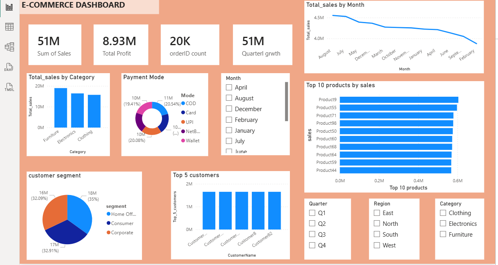

# E-Commerce Sales Dashboard

## Overview
Developed an interactive Power BI dashboard to analyze e-commerce sales performance, customer behavior, and product trends. The dashboard provides insights into revenue, profit, sales quantity, and regional performance through dynamic visualizations and filters.

## Key Features
- Sales and profit analysis
- Category and sub-category performance tracking
- Regional sales comparison
- Top-selling products identification
- Interactive slicers and filters

## Tools Used
- Power BI
- Excel
- Data Visualization

## Skills Demonstrated
- Data Cleaning
- Data Modeling
- DAX
- Dashboard Design
- Business Intelligence Reporting
## Dashboard Preview

